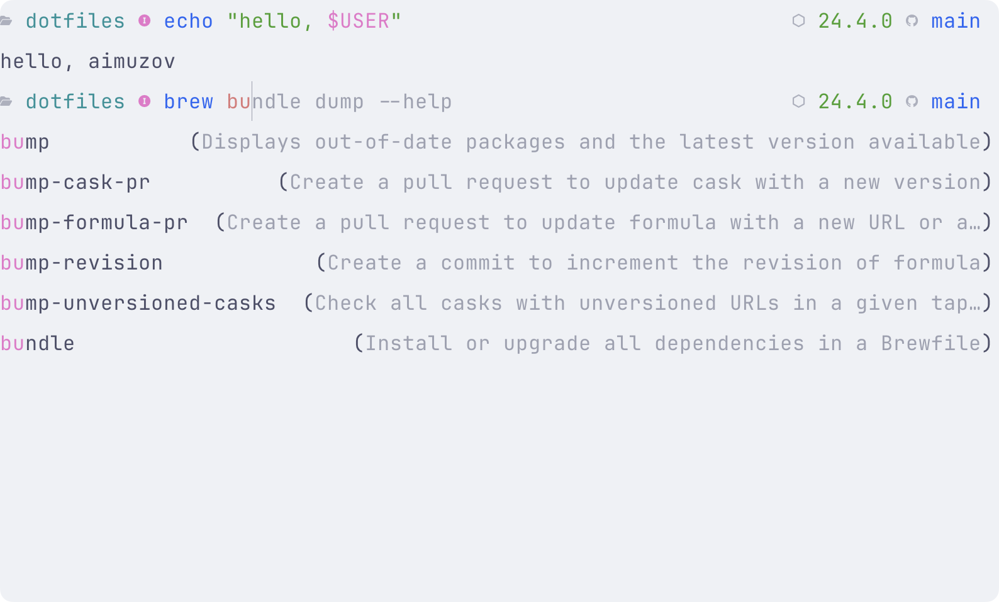

# Oh My Posh - Configuration

> 🇷🇺 [Русская версия](README.ru.md)

## Overview

Oh My Posh is a cross-platform tool for customizing the command line interface with support for various shells (bash, zsh, fish, powershell). This configuration is optimized for Fish shell and provides an informative and beautiful prompt.

---

## Screenshots

Here's how the Oh My Posh prompt looks with the current settings:

|                      Light theme                       |                      Dark theme                      |
| :----------------------------------------------------: | :--------------------------------------------------: |
|  |  |

**What's shown in the screenshots:**

- **Left block**: current directory path with 📄 icon and Fish shell mode indicator
- **Right block**: Node.js version (if installed) and Git information with upstream status
- **Color adaptation**: automatic switching between light and dark themes

---

## Configuration Structure

### Main Blocks

The configuration consists of two main blocks:

1. **Left block (prompt)** - displayed at the beginning of the line
2. **Right block (rprompt)** - displayed at the end of the line

### Version and Schema

```json
{
  "$schema": "https://raw.githubusercontent.com/JanDeDobbeleer/oh-my-posh/main/themes/schema.json",
  "version": 3
}
```

## Detailed Segment Description

### Left Block (prompt)

#### 1. Path Segment (path)

```json
{
  "foreground": "cyan",
  "properties": { "style": "folder" },
  "style": "plain",
  "template": "<white>📄</> {{ .Path }} ",
  "type": "path"
}
```

**Functionality:**

- Displays the current path in the file system
- Uses 📄 icon in white color
- Path is displayed in cyan color
- "folder" style provides shortening of long paths

#### 2. Fish Mode Segment (text)

```json
{
  "style": "plain",
  "template": "{{ if eq .Env.FISH_BIND_MODE \"default\" }}<blue>󰰓</>{{ else if eq .Env.FISH_BIND_MODE \"insert\" }}<magenta>󰰄</>{{ else if eq .Env.FISH_BIND_MODE \"replace_one\" }}<yellow>󰰟</>{{ else if eq .Env.FISH_BIND_MODE \"visual\"}}<cyan>󰰫</>{{ end }}",
  "type": "text"
}
```

**Functionality:**

- Displays the current Fish shell mode using icons
- **Default mode**: blue icon 󰰓
- **Insert mode**: magenta icon 󰰄
- **Replace One mode**: yellow icon 󰰟
- **Visual mode**: cyan icon 󰰫

### Right Block (rprompt)

#### 1. Node.js Segment (node)

```json
{
  "foreground": "green",
  "style": "plain",
  "template": "{{ if .Full }}<white>📦</> {{ .Full }} {{ end }}",
  "type": "node"
}
```

**Functionality:**

- Displays Node.js version if installed
- Shows 📦 icon in white color
- Version is displayed in green color
- Segment is hidden if Node.js is not installed

#### 2. Git Segment (git)

```json
{
  "type": "git",
  "style": "plain",
  "foreground": "blue",
  "template": "{{ if .UpstreamIcon }}<white>{{ .UpstreamIcon }}</> {{ end }}{{ if .HEAD }}{{ .HEAD }} {{ end }}",
  "properties": {
    "branch_icon": "",
    "fetch_status": true,
    "fetch_upstream_icon": true,
    "source": "cli",
    "mapped_branches": {
      "release/*": "r/",
      "feature/*": "f/",
      "bugfix/*": "b/"
    }
  }
}
```

**Functionality:**

- Displays Git repository information
- Shows upstream icon (synchronization with remote repository) in white color
- Displays current branch name
- Uses blue color for Git information
- Branch settings:
  - `release/*` → `r/`
  - `feature/*` → `f/`
  - `bugfix/*` → `b/`

## Color Scheme

- **White**: icons and accents
- **Cyan**: path and visual Fish mode
- **Blue**: default Fish mode and Git information
- **Magenta**: insert Fish mode
- **Yellow**: replace_one Fish mode
- **Green**: Node.js version

## Configuration Features

### Fish Shell Integration

- Automatic input mode detection
- Visual indicators for different modes
- Optimized for Fish shell operation

### Git Integration

- Automatic Git repository detection
- Synchronization status display
- Branch name shortening for better readability

### Adaptability

- Segments are hidden when information is unavailable
- Compact display on narrow terminals
- Support for various screen sizes

## Installation and Setup

### Prerequisites

1. Installed Fish shell
2. Oh My Posh
3. Font with Nerd Fonts support (for correct icon display)

### Installing Oh My Posh

#### macOS (Homebrew)

```bash
brew install oh-my-posh
```

#### Linux

```bash
wget https://github.com/JanDeDobbeleer/oh-my-posh/releases/latest/download/posh-linux-amd64 -O /usr/local/bin/oh-my-posh
chmod +x /usr/local/bin/oh-my-posh
```

### Fish Shell Setup

Add to `~/.config/fish/config.fish`:

```fish
oh-my-posh init fish --config ~/.config/oh-my-posh/config.json | source
```

## Customization

### Changing Colors

Edit the `foreground` field in the corresponding segment:

```json
"foreground": "red"  // Available colors: red, green, blue, yellow, magenta, cyan, white, black
```

### Adding New Segments

Add a new object to the `segments` array:

```json
{
  "type": "text",
  "style": "plain",
  "template": "Your text",
  "foreground": "green"
}
```

### Changing Icons

Replace Unicode characters in the `template` field:

```json
"template": "<white>🔧</> {{ .Path }} "
```

## Troubleshooting

### Icons Not Displaying

1. Make sure you're using a Nerd Fonts font
2. Check Unicode support in your terminal

### Git Information Not Showing

1. Make sure you're in a Git repository
2. Check access rights to the `.git` folder

### Fish Modes Not Displaying

1. Make sure you're using Fish shell
2. Check the `FISH_BIND_MODE` environment variable

## Useful Links

- [Official Oh My Posh Documentation](https://ohmyposh.dev/)
- [Available Segments](https://ohmyposh.dev/docs/segments/)
- [Fish Shell Documentation](https://fishshell.com/docs/current/)
- [Nerd Fonts](https://www.nerdfonts.com/)

## License

This configuration is part of the dotfiles project and is distributed under the same license as the main project.
