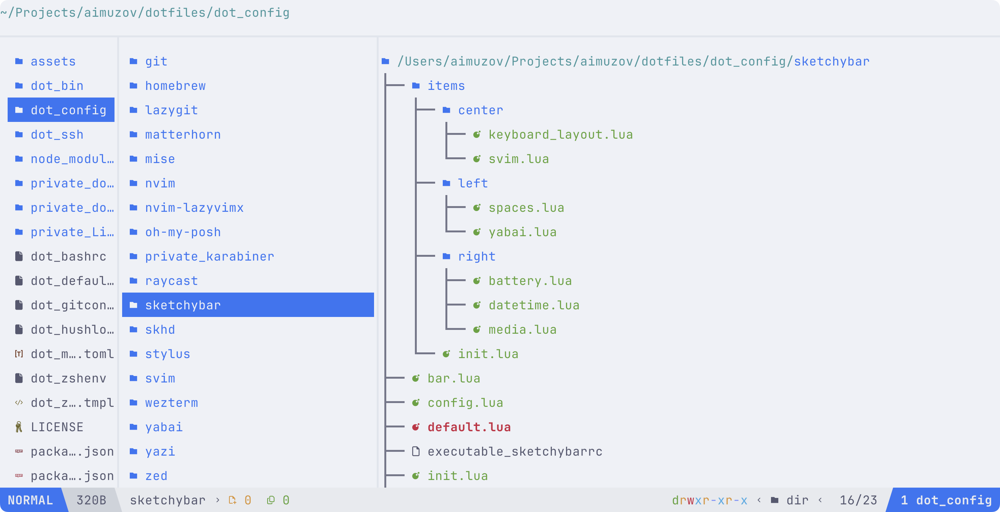
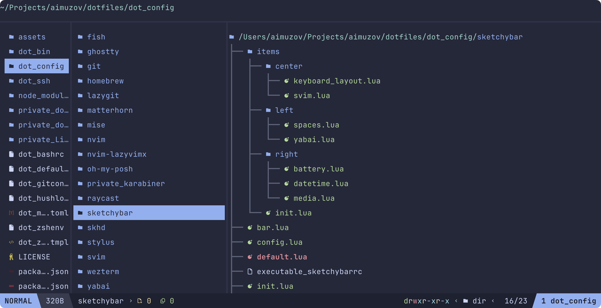

# Yazi Configuration

> 🇷🇺 [Русская версия](README.ru.md)

This folder contains user settings and plugins for the [Yazi](https://yazi-rs.github.io/) file manager.

---

## Screenshots

Here is how the Yazi interface looks with the current settings:

|                      Light theme                      |                     Dark theme                      |
| :---------------------------------------------------: | :-------------------------------------------------: |
|  |  |

---

## Contents

- `init.lua` — the main Lua script for advanced interface and plugin configuration in Yazi.
- `yazi.toml` — the main Yazi configuration file (behavior, plugins, file associations, etc.).
- `theme.toml` — defines the color scheme in use (e.g., Catppuccin).
- `keymap.toml` — custom hotkeys.
- `plugins/` — directory with Lua plugins (e.g., for border customization).

---

## File Descriptions

### `init.lua`

- Configures the `border` plugin for custom window borders.
- Simple initialization: `require("border"):setup()`
- The default Yazi statusline is used (yatline plugin was removed).

### `yazi.toml`

- Main parameters for Yazi operation: manager behavior, file associations, plugin and previewer connections.

#### [plugin] prepend_previewers

- Allows you to explicitly specify handlers for file preview by their MIME type or extension.
- **Supported formats and handlers:**
  - Archives (`zip`, `tar`, `bzip2`, `7z`, `rar`, `xz`): preview via [`ouch`](https://github.com/ouch-org/ouch).
  - Any directory (`*/`): preview via [`eza`](https://github.com/eza-community/eza) using `piper`.
  - Markdown files (`*.md`): preview via [`glow`](https://github.com/charmbracelet/glow) using `piper`.
- You can add your own handlers for any other formats by specifying the corresponding MIME type or filename mask.

### `theme.toml`

- Defines the color schemes used for light and dark themes, using [catppuccin](https://github.com/yazi-rs/flavors).

### `keymap.toml`

- Custom hotkeys for quick access to Yazi functions.

### `plugins/`

- Directory for Lua plugins. For example, `border.yazi/main.lua` adds custom borders to the interface.
- **Plugin installation** is performed automatically via [chezmoi externals](https://www.chezmoi.io/reference/special-files/chezmoiexternal-format/). The list and sources of Yazi plugins are described in [`../../.chezmoiexternals/yazi.toml`](../../.chezmoiexternals/yazi.toml).

---

## How to Add Your Own Plugin

1. Place the plugin's Lua file in the `plugins/` folder (e.g., `plugins/myplugin.yazi/main.lua`).
2. Connect it in `init.lua` using `require("myplugin")`.

---

## Notes

- All settings are adapted for macOS but can also be used on other systems.
- For some functions to work correctly, the corresponding environment variables are required (e.g., `MACOS_IS_DARK`).
