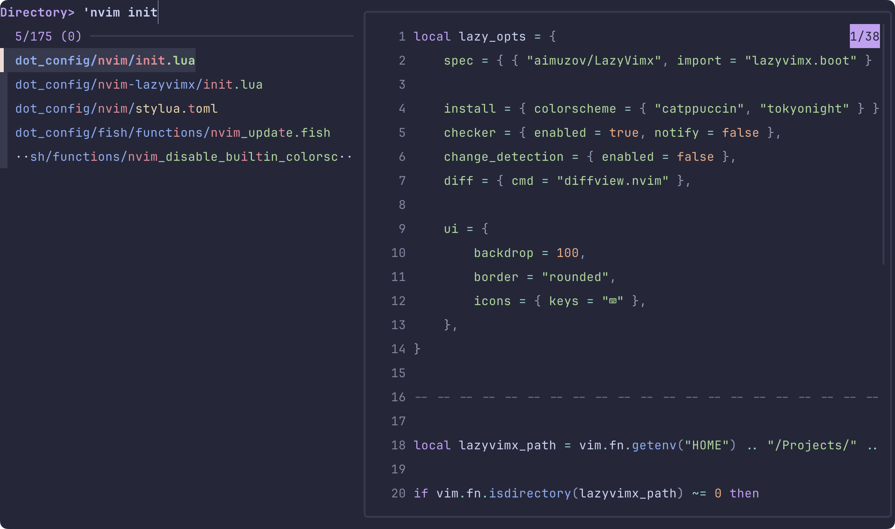

# Fish Shell Configuration Documentation

[🇷🇺 Русская версия](README.ru.md)

This document describes the configuration of the Fish shell environment.

## Table of Contents

- [XDG Base Directories](#xdg-base-directories)
- [Path Configuration](#path-configuration)
- [Theme and Appearance](#theme-and-appearance)
- [Cache Management](#cache-management)
- [Plugin Management](#plugin-management)
- [Shell Integration](#shell-integration)
- [Development Tools](#development-tools)
- [File Management](#file-management)
- [Key Bindings](#key-bindings)
- [Environment Variables](#environment-variables)
- [Abbreviations and Aliases](#abbreviations-and-aliases)
- [Custom Functions](#custom-functions)
- [Secrets Management](#secrets-management)

## XDG Base Directories

The configuration follows the XDG Base Directory Specification for organizing configuration files:

- `XDG_CONFIG_HOME`: `$HOME/.config`
- `XDG_DATA_HOME`: `$HOME/.local/share`
- `XDG_STATE_HOME`: `$HOME/.local/state`
- `XDG_CACHE_HOME`: `$HOME/.cache`

These directories are automatically created if they don't exist.

## Path Configuration

The configuration sets up various paths for functions and completions:

- Recursive function paths from `$__fish_config_dir/functions/*/`
- Recursive completion paths from `$__fish_config_dir/completions/*/`

## Theme and Appearance

The shell uses [Catppuccin](https://github.com/catppuccin/fish) theme with automatic dark/light mode detection based on macOS system settings:

- Dark mode: [Catppuccin Macchiato](https://github.com/catppuccin/fish)
- Light mode: [Catppuccin Latte](https://github.com/catppuccin/fish)

The theme automatically switches based on the system appearance setting.

## Cache Management

Cache files are managed in `$XDG_CACHE_HOME/fish`:

- Expired cache files (older than 1200 minutes) are automatically removed
- Cache initialization for various tools ([Homebrew](https://brew.sh/), [FZF](https://github.com/junegunn/fzf), [Zoxide](https://github.com/ajeetdsouza/zoxide), [mise](https://mise.jdx.dev/), etc.)
- Cached configurations for better performance

## Plugin Management

Uses [Fisher](https://github.com/jorgebucaran/fisher) as the plugin manager:

- Plugin directory: `$__fish_config_dir/.fisher`
- Custom plugins directory: `$__fish_config_dir/plugins`
- Automatic plugin initialization and updates

### Installed Plugins

- `[catppuccin/fzf](https://github.com/catppuccin/fzf)` - Catppuccin theme for [FZF](https://github.com/junegunn/fzf)
- `[jorgebucaran/fisher](https://github.com/jorgebucaran/fisher)` - Plugin manager itself
- `[PatrickF1/fzf.fish](https://github.com/PatrickF1/fzf.fish)` - [FZF](https://github.com/junegunn/fzf) integration for Fish
- `[wfxr/forgit](https://github.com/wfxr/forgit)` - Git workflow enhancement

## Shell Integration

### [Oh My Posh](https://ohmyposh.dev/)

- Custom prompt configuration from `$XDG_CONFIG_HOME/oh-my-posh/config.json`
- Automatic theme switching based on system appearance
- Version-based caching for performance

### FZF Integration

- Custom color schemes for dark/light modes using [Catppuccin](https://github.com/catppuccin/fish) themes
- Default commands and preview settings with [`fd`](https://github.com/sharkdp/fd)
- Integration with [`bat`](https://github.com/sharkdp/bat) for file preview
- Custom key bindings for navigation and file editing
- Integration with [`diff-so-fancy`](https://github.com/so-fancy/diff-so-fancy) for diff highlighting

#### Screenshots

Here is how [FZF](https://github.com/junegunn/fzf) looks with the current [Catppuccin](https://github.com/catppuccin/fish) theme settings:

|               Light theme                |               Dark theme               |
| :--------------------------------------: | :------------------------------------: |
|  |  |

### [Zoxide](https://github.com/ajeetdsouza/zoxide)

- Directory jumping functionality
- Automatic initialization with caching

### [Chezmoi](https://www.chezmoi.io/)

- Template management integration
- Automatic completion generation

## Development Tools

### Version Managers

- **[ASDF](https://asdf-vm.com/)**: Configuration for multiple language versions
  - Automatic shims setup
  - Completion generation
  - Config file location: `$HOME/.config/asdf/asdfrc`
- **[MISE](https://mise.jdx.dev/)**: Modern development environment management
  - Automatic activation
  - Completion generation
  - Install path: `/opt/homebrew/bin/mise`

### [Homebrew](https://brew.sh/)

- Automatic shell environment setup with caching
- Fish completions integration
- Analytics disabled by default (`HOMEBREW_NO_ANALYTICS=1`)

### WebOS TV SDK

- SDK home: `$HOME/stv-tools/webos-sdk`
- CLI tools path: `$LG_WEBOS_TV_SDK_HOME/bin`
- [Tizen Studio](https://developer.tizen.org/development/tizen-studio) integration

## File Management

### [EZA (Modern ls)](https://github.com/eza-community/eza)

- Custom color schemes using Vivid with [Catppuccin](https://github.com/catppuccin/fish) themes
- Various aliases for different listing options:
  - `l`: Basic listing with git ignore
  - `ll`: Detailed listing with headers
  - `llm`: Modified time sorting
  - `la`: All files with details
  - `lt`: Tree view

### [Bat](https://github.com/sharkdp/bat)

- Used as a replacement for `cat`
- Theme matching system appearance
- Syntax highlighting for various file types

## Key Bindings

- Vi mode enabled with custom bindings
- Clipboard integration for copy/paste operations
- Visual mode support
- Custom bindings:
  - `Ctrl+L` / `Ctrl+Д`: Clear screen and reinitialize
  - `Ctrl+E` / `Ctrl+У`: Open [Neovim](https://neovim.io/)
  - `y` in visual mode: Copy to clipboard
  - `yy` in normal mode: Copy line to clipboard
  - `p`: Paste from clipboard

## Environment Variables

### Editor Settings

- `EDITOR`: [Neovim](https://neovim.io/)
- `VISUAL`: Same as EDITOR
- `GIT_EDITOR`: Same as EDITOR

### Development

- `GOPATH`: `$HOME/Library/go`
- `LG_WEBOS_TV_SDK_HOME`: WebOS TV SDK location
- `BAT_THEME`: Matches system theme
- `SHELL`: Fish shell path

### Path Additions

- `$HOME/bin`, `$HOME/.bin`, `$HOME/.local/bin`
- `$HOME/.cargo/bin` (Rust)
- `$GOPATH/bin` (Go)
- `$WEBOS_CLI_TV` (WebOS tools)
- `node_modules/.bin` (Node.js)
- [Coreutils GNU binaries](https://www.gnu.org/software/coreutils/)

## Abbreviations and Aliases

### General

- `e`: Open [Neovim](https://neovim.io/)
- `y`: Open [Yazi](https://yazi-rs.github.io/) file manager
- `ca`: Apply [Chezmoi](https://www.chezmoi.io/) changes
- `ee`: [Neovim](https://neovim.io/) config picker
- `eu`: Update [Neovim](https://neovim.io/) plugins
- `f`: Fish performance test
- `q`: Exit shell

### Git

- `gb`: List branches
- `gba`: List all branches
- `gbsup`: Set upstream branch
- `gc!`: Amend commit
- `gcn!`: Amend commit without editing
- `gf`: Fetch
- `gfa`: Fetch all and prune
- `gl`: Pull
- `gp`: Push
- `gpsup`: Push and set upstream
- `gp!`: Force push with lease
- `gco`: Checkout
- `gcod`: Checkout develop
- `gcom`: Checkout main

### Git Flow

- `gfb`, `gff`, `gfr`, `gfh`, `gfs`: Git flow commands
- `gfbs`, `gffs`, `gfrs`, `gfhs`, `gfss`: Start flow branches
- `gfbt`, `gfft`, `gfrt`, `gfht`, `gfst`: Track flow branches

### Development

- `nr`: npm run
- `cat`: [bat](https://github.com/sharkdp/bat) (with syntax highlighting)
- Various `ls` alternatives using [eza](https://github.com/eza-community/eza)

## Custom Functions

The configuration includes several custom functions organized in the `functions` directory:

### [Neovim](https://neovim.io/) Related Functions

- `nvim_config_pick`: Interactive function to select and switch between different [Neovim](https://neovim.io/) configurations
  - Uses [`fd`](https://github.com/sharkdp/fd) and [FZF](https://github.com/junegunn/fzf) for configuration selection
  - Supports multiple [Neovim](https://neovim.io/) configurations via `NVIM_APPNAME`
- `nvim_update`: Updates [Neovim](https://neovim.io/) and its plugins
- `nvim_disable_builtin_colorschemes`: Disables built-in color schemes in [Neovim](https://neovim.io/)

### Git Related Functions

Located in `functions/git/`:

- `__git.current_branch`: Helper function to get the current Git branch name
- `gbda`: Git branch deletion utility for managing remote branches

### System Management Functions

- `wezterm_update_icon`: Updates WezTerm terminal icon
- `yabai_sudoers`: Manages Yabai window manager sudoers configuration
- `restart_vm`: Utility for restarting virtual machines
- `clear_and_reinit`: Clears screen and reinitializes fish

### Command Wrappers

Located in `functions/wrappers/`:

- `lazygit`: Wrapper for the [lazygit](https://github.com/jesseduffield/lazygit) terminal UI for Git
- `btm`: Wrapper for the [bottom (btm)](https://github.com/ClementTsang/bottom) system monitor
- `grep`: Enhanced grep wrapper

These functions enhance the shell's functionality and provide convenient shortcuts for common tasks. They are automatically loaded when the shell starts.

## Secrets Management

The configuration integrates with [KeePassXC](https://keepassxc.org/) for secure secret management:

- `OPENAI_API_KEY`: OpenAI API key
- `GITLAB_TOKEN`: GitLab access token
- `GITHUB_TOKEN`: GitHub access token

Secrets are automatically loaded from [KeePassXC](https://keepassxc.org/) using [Chezmoi](https://www.chezmoi.io/) template functions.

## Additional Features

- Automatic man page path configuration
- [VS Code](https://code.visualstudio.com/) and [Kiro](https://k0kubun.github.io/kiro/) shell integration
- Custom Git pathspec configuration (`_GIT_PATHSPEC`)
- Automatic completion generation for various tools
- Performance optimization through caching
- Integration with macOS system appearance changes
