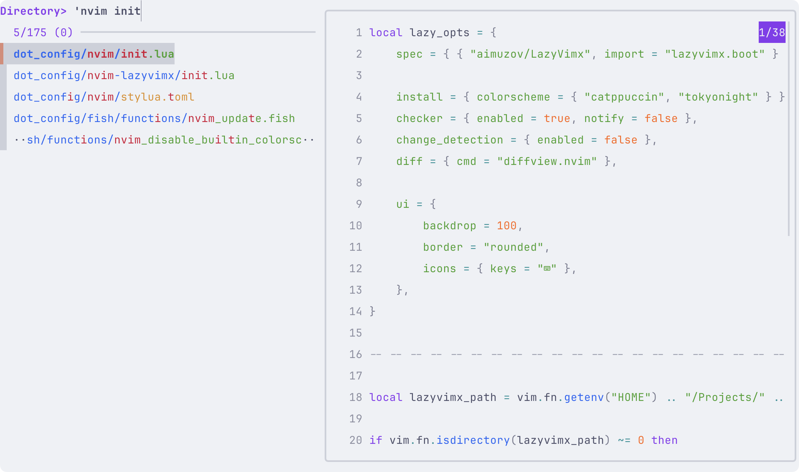
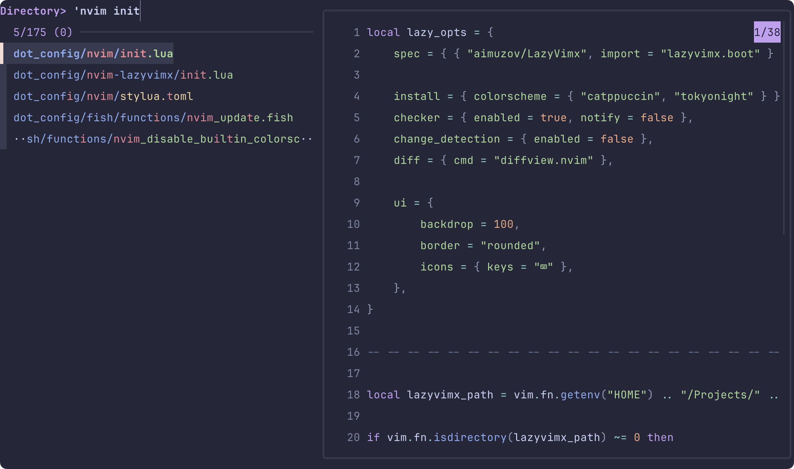

# Документация по настройке Fish Shell

[🇬🇧 English version](README.md)

Этот документ описывает конфигурацию окружения Fish shell.

## Содержание

- [Базовые директории XDG](#базовые-директории-xdg)
- [Настройка путей](#настройка-путей)
- [Тема и внешний вид](#тема-и-внешний-вид)
- [Управление кэшем](#управление-кэшем)
- [Управление плагинами](#управление-плагинами)
- [Интеграция с оболочкой](#интеграция-с-оболочкой)
- [Инструменты разработки](#инструменты-разработки)
- [Управление файлами](#управление-файлами)
- [Горячие клавиши](#горячие-клавиши)
- [Переменные окружения](#переменные-окружения)
- [Сокращения и псевдонимы](#сокращения-и-псевдонимы)
- [Пользовательские функции](#пользовательские-функции)
- [Управление секретами](#управление-секретами)

## Базовые директории XDG

Конфигурация следует спецификации XDG Base Directory для организации конфигурационных файлов:

- `XDG_CONFIG_HOME`: `$HOME/.config`
- `XDG_DATA_HOME`: `$HOME/.local/share`
- `XDG_STATE_HOME`: `$HOME/.local/state`
- `XDG_CACHE_HOME`: `$HOME/.cache`

Эти директории создаются автоматически, если они не существуют.

## Настройка путей

Конфигурация устанавливает различные пути для функций и автодополнений:

- Рекурсивные пути функций из `$__fish_config_dir/functions/*/`
- Рекурсивные пути автодополнений из `$__fish_config_dir/completions/*/`

## Тема и внешний вид

Оболочка использует тему [Catppuccin](https://github.com/catppuccin/fish) с автоматическим определением темной/светлой темы на основе настроек macOS:

- Тёмная тема: [Catppuccin Macchiato](https://github.com/catppuccin/fish)
- Светлая тема: [Catppuccin Latte](https://github.com/catppuccin/fish)

Тема автоматически переключается в зависимости от системного оформления.

## Управление кэшем

Файлы кэша управляются в `$XDG_CACHE_HOME/fish`:

- Устаревшие файлы кэша (старше 1200 минут) автоматически удаляются
- Инициализация кэша для различных инструментов ([Homebrew](https://brew.sh/), [FZF](https://github.com/junegunn/fzf), [Zoxide](https://github.com/ajeetdsouza/zoxide), [mise](https://mise.jdx.dev/) и т.д.)
- Кэшированные конфигурации для лучшей производительности

## Управление плагинами

Использует [Fisher](https://github.com/jorgebucaran/fisher) в качестве менеджера плагинов:

- Директория плагинов: `$__fish_config_dir/.fisher`
- Директория пользовательских плагинов: `$__fish_config_dir/plugins`
- Автоматическая инициализация и обновление плагинов

### Установленные плагины

- `[catppuccin/fzf](https://github.com/catppuccin/fzf)` — Тема [Catppuccin](https://github.com/catppuccin/fish) для [FZF](https://github.com/junegunn/fzf)
- `[jorgebucaran/fisher](https://github.com/jorgebucaran/fisher)` — Сам менеджер плагинов
- `[PatrickF1/fzf.fish](https://github.com/PatrickF1/fzf.fish)` — [FZF](https://github.com/junegunn/fzf) интеграция для Fish
- `[wfxr/forgit](https://github.com/wfxr/forgit)` — Улучшение Git workflow

## Интеграция с оболочкой

### [Oh My Posh](https://ohmyposh.dev/)

- Пользовательская конфигурация промпта из `$XDG_CONFIG_HOME/oh-my-posh/config.json`
- Автоматическое переключение темы в зависимости от системного оформления
- Кэширование на основе версии для производительности

### Интеграция [FZF](https://github.com/junegunn/fzf)

- Пользовательские цветовые схемы для темного/светлого режимов с использованием тем [Catppuccin](https://github.com/catppuccin/fish)
- Настройки команд и предпросмотра по умолчанию с [`fd`](https://github.com/sharkdp/fd)
- Интеграция с [`bat`](https://github.com/sharkdp/bat) для предпросмотра файлов
- Пользовательские горячие клавиши для навигации и редактирования файлов
- Интеграция с [`diff-so-fancy`](https://github.com/so-fancy/diff-so-fancy) для подсветки различий

#### Скриншоты

Вот как выглядит [FZF](https://github.com/junegunn/fzf) с текущими настройками темы [Catppuccin](https://github.com/catppuccin/fish):

|                Светлая тема                |               Тёмная тема                |
| :----------------------------------------: | :--------------------------------------: |
|  |  |

### [Zoxide](https://github.com/ajeetdsouza/zoxide)

- Функциональность перехода между директориями
- Автоматическая инициализация с кэшированием

### [Chezmoi](https://www.chezmoi.io/)

- Интеграция управления шаблонами
- Автоматическая генерация автодополнений

## Инструменты разработки

### Менеджеры версий

- **[ASDF](https://asdf-vm.com/)**: Конфигурация для нескольких версий языков
  - Автоматическая настройка shims
  - Генерация автодополнений
  - Расположение конфигурационного файла: `$HOME/.config/asdf/asdfrc`
- **[MISE](https://mise.jdx.dev/)**: Современное управление окружением разработки
  - Автоматическая активация
  - Генерация автодополнений
  - Путь установки: `/opt/homebrew/bin/mise`

### [Homebrew](https://brew.sh/)

- Автоматическая настройка окружения оболочки с кэшированием
- Интеграция автодополнений Fish
- Аналитика отключена по умолчанию (`HOMEBREW_NO_ANALYTICS=1`)

### WebOS TV SDK

- Домашняя директория SDK: `$HOME/stv-tools/webos-sdk`
- Путь к CLI инструментам: `$LG_WEBOS_TV_SDK_HOME/bin`
- Интеграция с [Tizen Studio](https://developer.tizen.org/development/tizen-studio)

## Управление файлами

### [EZA (Современный ls)](https://github.com/eza-community/eza)

- Пользовательские цветовые схемы с использованием Vivid и тем [Catppuccin](https://github.com/catppuccin/fish)
- Различные псевдонимы для разных вариантов вывода:
  - `l`: Базовый вывод с игнорированием git
  - `ll`: Подробный вывод с заголовками
  - `llm`: Сортировка по времени изменения
  - `la`: Все файлы с деталями
  - `lt`: Древовидный вид

### [Bat](https://github.com/sharkdp/bat)

- Используется как замена для `cat`
- Тема соответствует системному оформлению
- Подсветка синтаксиса для различных типов файлов

## Горячие клавиши

- Включен режим Vi с пользовательскими привязками
- Интеграция с буфером обмена для операций копирования/вставки
- Поддержка визуального режима
- Пользовательские привязки:
  - `Ctrl+L` / `Ctrl+Д`: Очистить экран и переинициализировать
  - `Ctrl+E` / `Ctrl+У`: Открыть [Neovim](https://neovim.io/)
  - `y` в визуальном режиме: Копировать в буфер обмена
  - `yy` в обычном режиме: Копировать строку в буфер обмена
  - `p`: Вставить из буфера обмена

## Переменные окружения

### Настройки редактора

- `EDITOR`: [Neovim](https://neovim.io/)
- `VISUAL`: То же, что и EDITOR
- `GIT_EDITOR`: То же, что и EDITOR

### Разработка

- `GOPATH`: `$HOME/Library/go`
- `LG_WEBOS_TV_SDK_HOME`: Расположение WebOS TV SDK
- `BAT_THEME`: Соответствует системной теме
- `SHELL`: Путь к оболочке Fish

### Добавления в PATH

- `$HOME/bin`, `$HOME/.bin`, `$HOME/.local/bin`
- `$HOME/.cargo/bin` (Rust)
- `$GOPATH/bin` (Go)
- `$WEBOS_CLI_TV` (Инструменты WebOS)
- `node_modules/.bin` (Node.js)
- [GNU бинарники Coreutils](https://www.gnu.org/software/coreutils/)

## Сокращения и псевдонимы

### Общие

- `e`: Открыть [Neovim](https://neovim.io/)
- `y`: Открыть файловый менеджер [Yazi](https://yazi-rs.github.io/)
- `ca`: Применить изменения [Chezmoi](https://www.chezmoi.io/)
- `ee`: Выбор конфигурации [Neovim](https://neovim.io/)
- `eu`: Обновить плагины [Neovim](https://neovim.io/)
- `f`: Тест производительности Fish
- `q`: Выйти из оболочки

### Git

- `gb`: Список веток
- `gba`: Список всех веток
- `gbsup`: Установить upstream ветку
- `gc!`: Исправить коммит
- `gcn!`: Исправить коммит без редактирования
- `gf`: Получить изменения
- `gfa`: Получить все изменения и очистить
- `gl`: Стянуть изменения
- `gp`: Отправить изменения
- `gpsup`: Отправить и установить upstream
- `gp!`: Принудительная отправка с lease
- `gco`: Переключение ветки
- `gcod`: Переключиться на develop
- `gcom`: Переключиться на main

### Git Flow

- `gfb`, `gff`, `gfr`, `gfh`, `gfs`: Команды Git flow
- `gfbs`, `gffs`, `gfrs`, `gfhs`, `gfss`: Начать ветки flow
- `gfbt`, `gfft`, `gfrt`, `gfht`, `gfst`: Отслеживать ветки flow

### Разработка

- `nr`: npm run
- `cat`: [bat](https://github.com/sharkdp/bat) (с подсветкой синтаксиса)
- Различные альтернативы `ls` с использованием [eza](https://github.com/eza-community/eza)

## Пользовательские функции

Конфигурация включает несколько пользовательских функций, организованных в директории `functions`:

### Функции, связанные с [Neovim](https://neovim.io/)

- `nvim_config_pick`: Интерактивная функция для выбора и переключения между различными конфигурациями [Neovim](https://neovim.io/)
  - Использует [`fd`](https://github.com/sharkdp/fd) и [FZF](https://github.com/junegunn/fzf) для выбора конфигурации
  - Поддерживает несколько конфигураций [Neovim](https://neovim.io/) через `NVIM_APPNAME`
- `nvim_update`: Обновление [Neovim](https://neovim.io/) и его плагинов
- `nvim_disable_builtin_colorschemes`: Отключение встроенных цветовых схем в [Neovim](https://neovim.io/)

### Функции, связанные с Git

Расположены в `functions/git/`:

- `__git.current_branch`: Вспомогательная функция для получения имени текущей ветки Git
- `gbda`: Утилита удаления веток Git для управления удаленными ветками

### Функции управления системой

- `wezterm_update_icon`: Обновление иконки терминала WezTerm
- `yabai_sudoers`: Управление конфигурацией sudoers для оконного менеджера Yabai
- `restart_vm`: Утилита для перезапуска виртуальных машин
- `clear_and_reinit`: Очистить экран и переинициализировать fish

### Обертки команд

Расположены в `functions/wrappers/`:

- `lazygit`: Обертка для терминального интерфейса [lazygit](https://github.com/jesseduffield/lazygit) для Git
- `btm`: Обертка для системного монитора [bottom (btm)](https://github.com/ClementTsang/bottom)
- `grep`: Улучшенная обертка для grep

Эти функции расширяют функциональность оболочки и предоставляют удобные сокращения для часто используемых задач. Они автоматически загружаются при запуске оболочки.

## Управление секретами

Конфигурация интегрируется с [KeePassXC](https://keepassxc.org/) для безопасного управления секретами:

- `OPENAI_API_KEY`: API ключ OpenAI
- `GITLAB_TOKEN`: Токен доступа GitLab
- `GITHUB_TOKEN`: Токен доступа GitHub

Секреты автоматически загружаются из [KeePassXC](https://keepassxc.org/) с использованием функций шаблонов [Chezmoi](https://www.chezmoi.io/).

## Дополнительные возможности

- Автоматическая настройка путей для man-страниц
- Интеграция с [VS Code](https://code.visualstudio.com/) и [Kiro](https://k0kubun.github.io/kiro)
- Пользовательская конфигурация Git pathspec (`_GIT_PATHSPEC`)
- Автоматическая генерация автодополнений для различных инструментов
- Оптимизация производительности через кэширование
- Интеграция с изменениями системного оформления macOS
