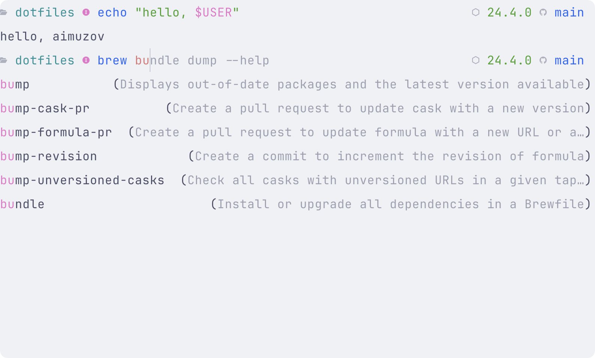

# Oh My Posh - Конфигурация

> 🇬🇧 [English version](README.md)

## Обзор

Oh My Posh - это кроссплатформенный инструмент для настройки командной строки с поддержкой различных оболочек (bash, zsh, fish, powershell). Данная конфигурация оптимизирована для работы с Fish shell и предоставляет информативный и красивый промпт.

---

## Скриншоты

Вот как выглядит промпт Oh My Posh с текущими настройками:

|                      Светлая тема                      |                     Тёмная тема                      |
| :----------------------------------------------------: | :--------------------------------------------------: |
|  |  |

**Что показано на скриншотах:**

- **Левый блок**: путь к текущей директории с иконкой 📄 и индикатор режима Fish shell
- **Правый блок**: версия Node.js (если установлена) и Git информация с upstream статусом
- **Цветовая адаптация**: автоматическое переключение между светлой и тёмной темой

---

## Структура конфигурации

### Основные блоки

Конфигурация состоит из двух основных блоков:

1. **Левый блок (prompt)** - отображается в начале строки
2. **Правый блок (rprompt)** - отображается в конце строки

### Версия и схема

```json
{
  "$schema": "https://raw.githubusercontent.com/JanDeDobbeleer/oh-my-posh/main/themes/schema.json",
  "version": 3
}
```

## Детальное описание сегментов

### Левый блок (prompt)

#### 1. Сегмент пути (path)

```json
{
  "foreground": "cyan",
  "properties": { "style": "folder" },
  "style": "plain",
  "template": "<white>📄</> {{ .Path }} ",
  "type": "path"
}
```

**Функциональность:**

- Отображает текущий путь в файловой системе
- Использует иконку 📄 в белом цвете
- Путь отображается в голубом цвете (cyan)
- Стиль "folder" обеспечивает сокращение длинных путей

#### 2. Сегмент режима Fish (text)

```json
{
  "style": "plain",
  "template": "{{ if eq .Env.FISH_BIND_MODE \"default\" }}<blue>󰰓</>{{ else if eq .Env.FISH_BIND_MODE \"insert\" }}<magenta>󰰄</>{{ else if eq .Env.FISH_BIND_MODE \"replace_one\" }}<yellow>󰰟</>{{ else if eq .Env.FISH_BIND_MODE \"visual\"}}<cyan>󰰫</>{{ end }}",
  "type": "text"
}
```

**Функциональность:**

- Отображает текущий режим Fish shell с помощью иконок
- **Default режим**: синяя иконка 󰰓
- **Insert режим**: пурпурная иконка 󰰄
- **Replace One режим**: жёлтая иконка 󰰟
- **Visual режим**: голубая иконка 󰰫

### Правый блок (rprompt)

#### 1. Сегмент Node.js (node)

```json
{
  "foreground": "green",
  "style": "plain",
  "template": "{{ if .Full }}<white>📦</> {{ .Full }} {{ end }}",
  "type": "node"
}
```

**Функциональность:**

- Отображает версию Node.js, если она установлена
- Показывает иконку 📦 в белом цвете
- Версия отображается в зелёном цвете
- Сегмент скрыт, если Node.js не установлен

#### 2. Сегмент Git (git)

```json
{
  "type": "git",
  "style": "plain",
  "foreground": "blue",
  "template": "{{ if .UpstreamIcon }}<white>{{ .UpstreamIcon }}</> {{ end }}{{ if .HEAD }}{{ .HEAD }} {{ end }}",
  "properties": {
    "branch_icon": "",
    "fetch_status": true,
    "fetch_upstream_icon": true,
    "source": "cli",
    "mapped_branches": {
      "release/*": "r/",
      "feature/*": "f/",
      "bugfix/*": "b/"
    }
  }
}
```

**Функциональность:**

- Отображает информацию о Git репозитории
- Показывает иконку upstream (синхронизация с удалённым репозиторием) в белом цвете
- Отображает имя текущей ветки
- Использует синий цвет для Git информации
- Настройки веток:
  - `release/*` → `r/`
  - `feature/*` → `f/`
  - `bugfix/*` → `b/`

## Цветовая схема

- **Белый**: иконки и акценты
- **Голубой (cyan)**: путь и visual режим Fish
- **Синий (blue)**: default режим Fish и Git информация
- **Пурпурный (magenta)**: insert режим Fish
- **Жёлтый (yellow)**: replace_one режим Fish
- **Зелёный (green)**: версия Node.js

## Особенности конфигурации

### Fish Shell интеграция

- Автоматическое определение режима ввода
- Визуальные индикаторы для разных режимов
- Оптимизировано для работы с Fish shell

### Git интеграция

- Автоматическое определение Git репозитория
- Отображение статуса синхронизации
- Сокращение имён веток для лучшей читаемости

### Адаптивность

- Сегменты скрываются, когда информация недоступна
- Компактное отображение на узких терминалах
- Поддержка различных размеров экрана

## Установка и настройка

### Предварительные требования

1. Установленный Fish shell
2. Oh My Posh
3. Шрифт с поддержкой Nerd Fonts (для корректного отображения иконок)

### Установка Oh My Posh

#### macOS (Homebrew)

```bash
brew install oh-my-posh
```

#### Linux

```bash
wget https://github.com/JanDeDobbeleer/oh-my-posh/releases/latest/download/posh-linux-amd64 -O /usr/local/bin/oh-my-posh
chmod +x /usr/local/bin/oh-my-posh
```

### Настройка Fish shell

Добавьте в `~/.config/fish/config.fish`:

```fish
oh-my-posh init fish --config ~/.config/oh-my-posh/config.json | source
```

## Кастомизация

### Изменение цветов

Отредактируйте поле `foreground` в соответствующем сегменте:

```json
"foreground": "red"  // Доступные цвета: red, green, blue, yellow, magenta, cyan, white, black
```

### Добавление новых сегментов

Добавьте новый объект в массив `segments`:

```json
{
  "type": "text",
  "style": "plain",
  "template": "Ваш текст",
  "foreground": "green"
}
```

### Изменение иконок

Замените Unicode символы в поле `template`:

```json
"template": "<white>🔧</> {{ .Path }} "
```

## Устранение неполадок

### Иконки не отображаются

1. Убедитесь, что используется шрифт Nerd Fonts
2. Проверьте поддержку Unicode в терминале

### Git информация не показывается

1. Убедитесь, что находитесь в Git репозитории
2. Проверьте права доступа к `.git` папке

### Fish режимы не отображаются

1. Убедитесь, что используется Fish shell
2. Проверьте переменную окружения `FISH_BIND_MODE`

## Полезные ссылки

- [Официальная документация Oh My Posh](https://ohmyposh.dev/)
- [Доступные сегменты](https://ohmyposh.dev/docs/segments/)
- [Fish shell документация](https://fishshell.com/docs/current/)
- [Nerd Fonts](https://www.nerdfonts.com/)

## Лицензия

Данная конфигурация является частью dotfiles проекта и распространяется под той же лицензией, что и основной проект.
